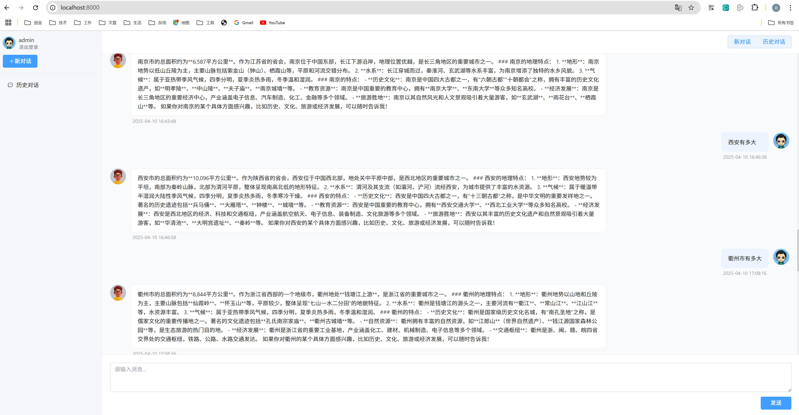

# Author：黄炎

    基于LLM接口和fastapi开发的一套对话机器人系统，未来或许支持自定义知识库。
    已部署到 https://fastapirag.nxtech.site/ 用户名 admin 密码 admin123456 【注：由于我的火山云deepseek免费token很快用完，此站点只开放到五月一日】
    自动API文档：https://fastapirag-admin.nxtech.site/docs/
    后端框架fastapi，前端框架vue3,数据库用到sqlite3, (未来)加elasticsearch和redis。

    （待实现）基于langchain使用了nltk进行文本分段，使用了bge3模型进行文本向量化。
    （待实现）核心功能：文档知识库管理，基于知识库进行大模型的答疑，对回答问题提供引用，不回答超出知识库的内容。

## 效果截图
    

## 模块代码介绍
    
    backend 后端【fastapi】
    -- apps 主要业务模块
    ---- base 基础app
    ---- models 数据库处理模块 包含User和ChatMessage
    ---- views 页面
    ------ user_auth 用户相关处理
    ------ chat_ai 和AI聊天
    ---- utils 通用库，其代码在本项目内通用
    ---- exlib 通用库，其代码在公司任意项目中通用
    ---- tests 测试
    web 前端【vue3】
    -- components 组件
    -- router 路由
    -- utils 通用工具
    -- views 页面

## 开发说明
    
    采用前后端一体的开发模式，所有代码及相关部署均由 @黄炎 单人完成开发。
    核心代码由人检阅，辅助代码由cursor/claude 3.7 达成，效果测试良好。

## 扩展【可能做但超出了产品要求的】

    原始产品要求【已经全部达成】：    
        FastAPI + pydantic + Tortoise ORM + JWT token authentication + 火山免费Deepseek API服务，实现一个可用的服务出来  
    新对话功能目前是一个假功能，新的对话会仍然塞进历史对话里去。
    知识库功能，允许上传文档建立新知识。

## 部署说明:

    后端
    1、填配置：复制config.yaml.template为local_config.yaml 放在backend下，处理好具体配置。
    2、装依赖：pip install -r requirements.txt -i https://mirrors.aliyun.com/pypi/simple/
    3、首次启动，会自动创建数据库文件。
    4、创建用户：运行tests中create_user.py
    5、cd ./backend/apps python main.py启动项目

    前端
    1。.env.development 设置测试环境后端域名 .env.production设置前端环境域名，例如 VITE_API_BASE_URL = http://localhost:8798
    2、npm install
    3、npm run dev

    